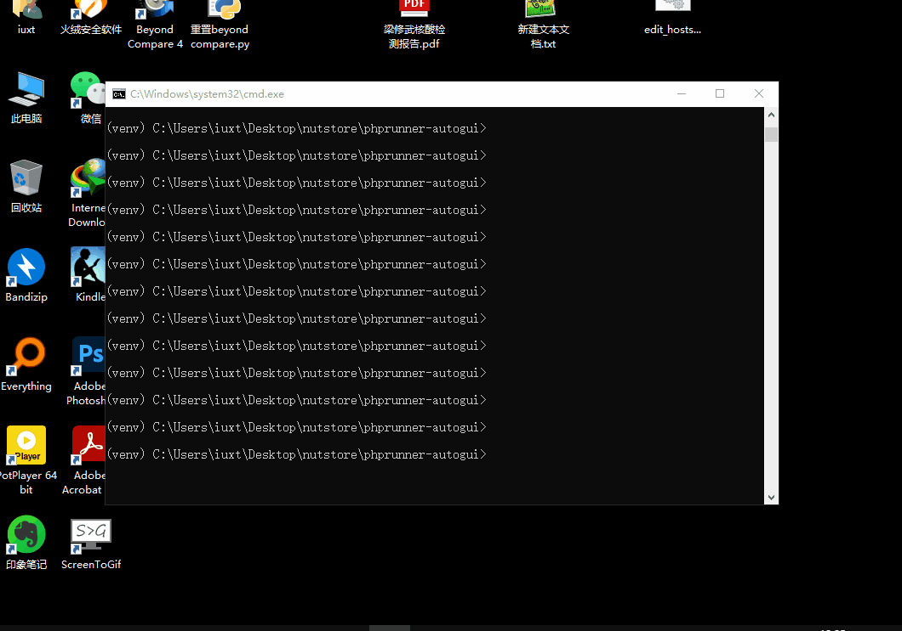

## phprunner-autogui

这是一个gui自动化项目，具体效果看图

## auto-openvpn

这个项目是自动连接openvpn的，之前工作的时候需要用到openvpn，但是连接太麻烦，还需要动态密码，所以写了这个小工具

## flask-radius

这个项目是一个radius前端管理界面，通过登录员工账号可以获得一个专属的wifi密码，然后登录wifi，离职后删除账号，无法访问网络

